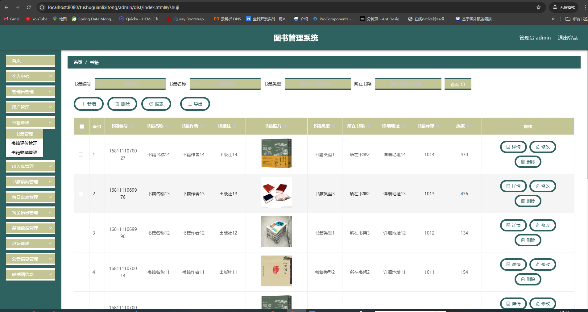
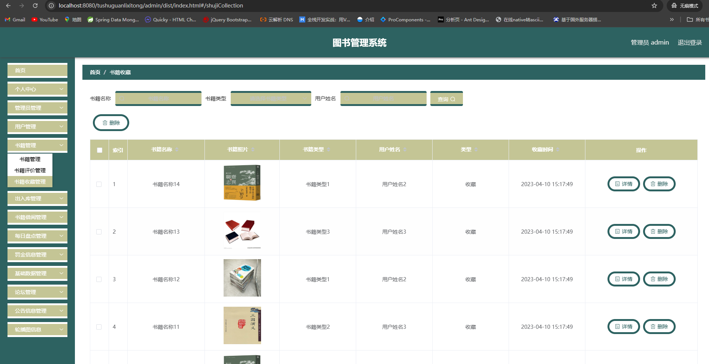
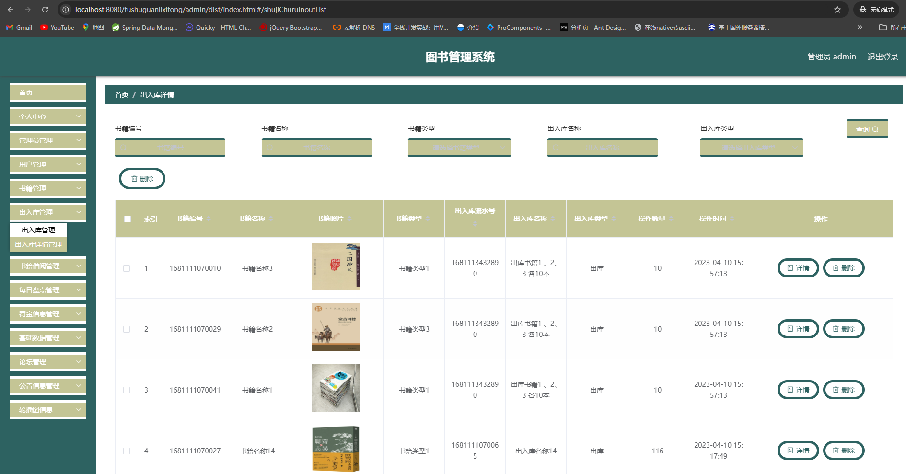
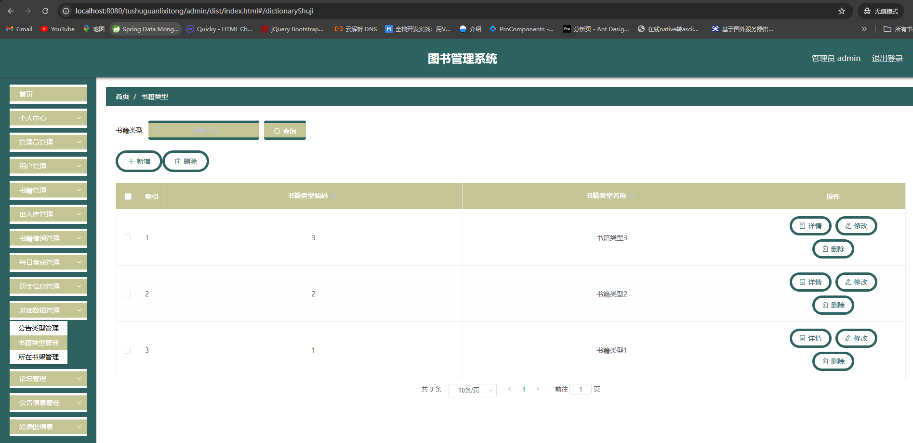

# 一、系统说明

基于springboot+vue的图书管理系统,系统功能齐全, 代码简洁易懂，适合小白学编程。

# 二、系统架构

######      前端：vue| elementui

######      后端：springboot | mybatis 

######      环境：jdk1.8+ | mysql8.0 | maven

# 三、代码及数据库

# 四、相关功能介绍

#### 1).用户展示

###### 1.首页

###### 2.图书借阅

包含书籍评论，借阅

###### 3.论坛

###### 4.帖子评价

###### 5.书籍列表

###### 6.个人中心

###### 7.个人中心->罚金信息

###### 8.个人中心->书籍收藏

###### 9.个人中心->书籍借阅

其中包含还书、评价功能

###### 10.用户注册

###### 2).管理端

###### 1.登录

###### 2.个人中心->修改密码

###### 3.管理员管理

###### 4.用户管理

###### 5.书籍管理

###### 6.书籍管理->书籍评价管理

###### 7.书籍管理->书籍收藏管理

###### 8.出入库管理

###### 9.出入库管理->出入库详情

###### 10.书籍借阅管理

###### 11.每日盘点管理

###### 12.罚金信息管理

###### 13.基础数据管理->公告类型管理

###### 14.基础数据管理->书籍类型管理

###### 15.基础数据管理->所在书架管理

###### 16.论坛管理

###### 17.公告信息管理

###### 18.轮播图管理

